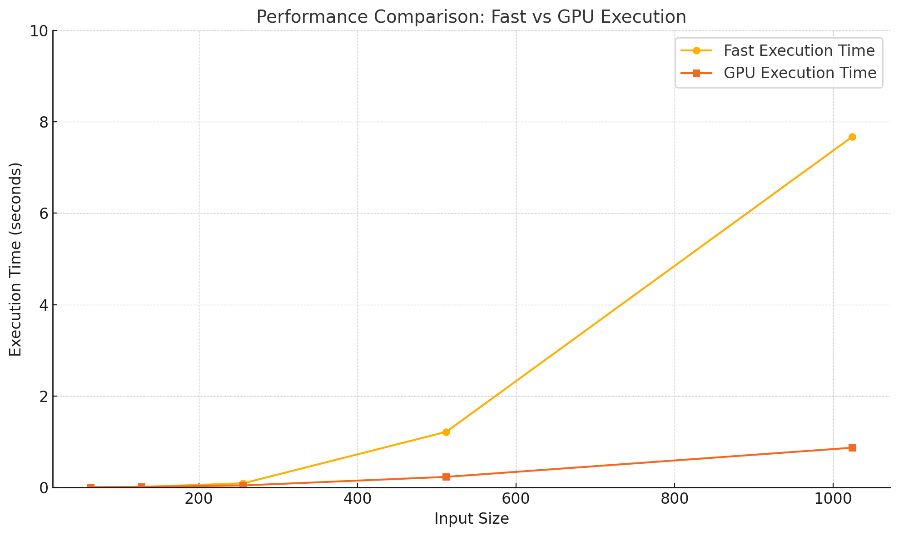

# MiniTorch Module 3


* Docs: https://minitorch.github.io/

* Overview: https://minitorch.github.io/module3.html


You will need to modify `tensor_functions.py` slightly in this assignment.

* Tests:

```
python run_tests.py
```

* Note:

Several of the tests for this assignment will only run if you are on a GPU machine and will not
run on github's test infrastructure. Please follow the instructions to setup up a colab machine
to run these tests.

This assignment requires the following files from the previous assignments. You can get these by running

```bash
python sync_previous_module.py previous-module-dir current-module-dir
```

The files that will be synced are:

        minitorch/tensor_data.py minitorch/tensor_functions.py minitorch/tensor_ops.py minitorch/operators.py minitorch/scalar.py minitorch/scalar_functions.py minitorch/module.py minitorch/autodiff.py minitorch/module.py project/run_manual.py project/run_scalar.py project/run_tensor.py minitorch/operators.py minitorch/module.py minitorch/autodiff.py minitorch/tensor.py minitorch/datasets.py minitorch/testing.py minitorch/optim.py

# Task 3.1&3.2:

```console
(.venv) PS C:\Users\NING0\mle\mod3-Zening-W> python project/parallel_check.py
MAP
(.venv) PS C:\Users\NING0\mle\mod3-Zening-W> python project/parallel_check.py
MAP

================================================================================
 Parallel Accelerator Optimizing:  Function tensor_map.<locals>._map,
C:\Users\NING0\mle\mod3-Zening-W\minitorch\fast_ops.py (164)
================================================================================


Parallel loop listing for  Function tensor_map.<locals>._map, C:\Users\NING0\mle\mod3-Zening-W\minitorch\fast_ops.py (164)
-------------------------------------------------------------------------|loop #ID
    def _map(                                                            |
        out: Storage,                                                    |
        out_shape: Shape,                                                |
        out_strides: Strides,                                            |
        in_storage: Storage,                                             |
        in_shape: Shape,                                                 |
        in_strides: Strides,                                             |
    ) -> None:                                                           |
        # TODO: Implement for Task 3.1.                                  |
        if np.array_equal(out_shape, in_shape) and np.array_equal(       |
            out_strides, in_strides                                      |
        ):                                                               |
            for i in prange(len(out)):-----------------------------------| #2
                out[i] = fn(in_storage[i])                               |
            return                                                       |
        # Calculate the total size of the tensor                         |
        size = len(out)                                                  |
                                                                         |
        # Parallelize the main loop using prange                         |
        for i in prange(size):-------------------------------------------| #3
            # Convert linear index i to tensor index                     |
            out_index = np.zeros(MAX_DIMS, np.int32)---------------------| #0
            to_index(i, out_shape, out_index)                            |
                                                                         |
            # Map output index to input index (for broadcasting)         |
            in_index = np.zeros(MAX_DIMS, np.int32)----------------------| #1
            broadcast_index(out_index, out_shape, in_shape, in_index)    |
                                                                         |
            # Calculate positions in storage                             |
            out_pos = index_to_position(out_index, out_strides)          |
            in_pos = index_to_position(in_index, in_strides)             |
                                                                         |
            # Apply the function and store result                        |
            out[out_pos] = fn(in_storage[in_pos])                        |
--------------------------------- Fusing loops ---------------------------------
Attempting fusion of parallel loops (combines loops with similar properties)...
Following the attempted fusion of parallel for-loops there are 3 parallel for-
loop(s) (originating from loops labelled: #2, #3, #0).
--------------------------------------------------------------------------------
---------------------------- Optimising loop nests -----------------------------
Attempting loop nest rewrites (optimising for the largest parallel loops)...

+--3 is a parallel loop
   +--0 --> rewritten as a serial loop
   +--1 --> rewritten as a serial loop
--------------------------------------------------------------------------------
----------------------------- Before Optimisation ------------------------------
Parallel region 0:
+--3 (parallel)
   +--0 (parallel)
   +--1 (parallel)


--------------------------------------------------------------------------------
------------------------------ After Optimisation ------------------------------
Parallel region 0:
+--3 (parallel)
   +--0 (serial)
   +--1 (serial)


Parallel region 0 (loop #3) had 0 loop(s) fused and 2 loop(s) serialized as part
 of the larger parallel loop (#3).
--------------------------------------------------------------------------------
--------------------------------------------------------------------------------

---------------------------Loop invariant code motion---------------------------
Allocation hoisting:
The memory allocation derived from the instruction at
C:\Users\NING0\mle\mod3-Zening-W\minitorch\fast_ops.py (189) is hoisted out of
the parallel loop labelled #3 (it will be performed before the loop is executed
and reused inside the loop):
   Allocation:: in_index = np.zeros(MAX_DIMS, np.int32)
    - numpy.empty() is used for the allocation.
The memory allocation derived from the instruction at
C:\Users\NING0\mle\mod3-Zening-W\minitorch\fast_ops.py (185) is hoisted out of
the parallel loop labelled #3 (it will be performed before the loop is executed
and reused inside the loop):
   Allocation:: out_index = np.zeros(MAX_DIMS, np.int32)
    - numpy.empty() is used for the allocation.
None
ZIP

================================================================================
 Parallel Accelerator Optimizing:  Function tensor_zip.<locals>._zip,
C:\Users\NING0\mle\mod3-Zening-W\minitorch\fast_ops.py (225)
================================================================================


Parallel loop listing for  Function tensor_zip.<locals>._zip, C:\Users\NING0\mle\mod3-Zening-W\minitorch\fast_ops.py (225)
-----------------------------------------------------------------------------|loop #ID
    def _zip(                                                                |
        out: Storage,                                                        |
        out_shape: Shape,                                                    |
        out_strides: Strides,                                                |
        a_storage: Storage,                                                  |
        a_shape: Shape,                                                      |
        a_strides: Strides,                                                  |
        b_storage: Storage,                                                  |
        b_shape: Shape,                                                      |
        b_strides: Strides,                                                  |
    ) -> None:                                                               |
        if (                                                                 |
            np.array_equal(out_shape, a_shape)                               |
            and np.array_equal(out_shape, b_shape)                           |
            and np.array_equal(out_strides, a_strides)                       |
            and np.array_equal(out_strides, b_strides)                       |
        ):                                                                   |
            for out_ord in prange(len(out)):---------------------------------| #7
                out[out_ord] = fn(a_storage[out_ord], b_storage[out_ord])    |
            return                                                           |
        # Calculate total size of output tensor                              |
        size = len(out)                                                      |
                                                                             |
        # Parallelize the main loop using prange                             |
        for i in prange(size):-----------------------------------------------| #8
            # Convert linear index to tensor index                           |
            out_index = np.zeros(MAX_DIMS, np.int32)-------------------------| #4
            to_index(i, out_shape, out_index)                                |
                                                                             |
            # Map output index to input indices (for broadcasting)           |
            a_index = np.zeros(MAX_DIMS, np.int32)---------------------------| #5
            b_index = np.zeros(MAX_DIMS, np.int32)---------------------------| #6
            broadcast_index(out_index, out_shape, a_shape, a_index)          |
            broadcast_index(out_index, out_shape, b_shape, b_index)          |
                                                                             |
            # Calculate positions in storage                                 |
            out_pos = index_to_position(out_index, out_strides)              |
            a_pos = index_to_position(a_index, a_strides)                    |
            b_pos = index_to_position(b_index, b_strides)                    |
                                                                             |
            # Apply binary function to inputs and store result               |
            out[out_pos] = fn(a_storage[a_pos], b_storage[b_pos])            |
--------------------------------- Fusing loops ---------------------------------
Attempting fusion of parallel loops (combines loops with similar properties)...

Fused loop summary:
+--5 has the following loops fused into it:
   +--6 (fused)
Following the attempted fusion of parallel for-loops there are 3 parallel for-
loop(s) (originating from loops labelled: #7, #8, #4).
--------------------------------------------------------------------------------
---------------------------- Optimising loop nests -----------------------------
Attempting loop nest rewrites (optimising for the largest parallel loops)...

+--8 is a parallel loop
   +--4 --> rewritten as a serial loop
   +--5 --> rewritten as a serial loop
--------------------------------------------------------------------------------
----------------------------- Before Optimisation ------------------------------
Parallel region 0:
+--8 (parallel)
   +--4 (parallel)
   +--5 (parallel)
   +--6 (parallel)


--------------------------------------------------------------------------------
------------------------------ After Optimisation ------------------------------
Parallel region 0:
+--8 (parallel)
   +--4 (serial)
   +--5 (serial, fused with loop(s): 6)


Parallel region 0 (loop #8) had 1 loop(s) fused and 2 loop(s) serialized as part
 of the larger parallel loop (#8).
--------------------------------------------------------------------------------
--------------------------------------------------------------------------------

---------------------------Loop invariant code motion---------------------------
Allocation hoisting:
The memory allocation derived from the instruction at
C:\Users\NING0\mle\mod3-Zening-W\minitorch\fast_ops.py (251) is hoisted out of
the parallel loop labelled #8 (it will be performed before the loop is executed
and reused inside the loop):
   Allocation:: out_index = np.zeros(MAX_DIMS, np.int32)
    - numpy.empty() is used for the allocation.
The memory allocation derived from the instruction at
C:\Users\NING0\mle\mod3-Zening-W\minitorch\fast_ops.py (255) is hoisted out of
the parallel loop labelled #8 (it will be performed before the loop is executed
and reused inside the loop):
   Allocation:: a_index = np.zeros(MAX_DIMS, np.int32)
    - numpy.empty() is used for the allocation.
The memory allocation derived from the instruction at
C:\Users\NING0\mle\mod3-Zening-W\minitorch\fast_ops.py (256) is hoisted out of
the parallel loop labelled #8 (it will be performed before the loop is executed
and reused inside the loop):
   Allocation:: b_index = np.zeros(MAX_DIMS, np.int32)
    - numpy.empty() is used for the allocation.
None
REDUCE

================================================================================
 Parallel Accelerator Optimizing:  Function tensor_reduce.<locals>._reduce,
C:\Users\NING0\mle\mod3-Zening-W\minitorch\fast_ops.py (292)
================================================================================


Parallel loop listing for  Function tensor_reduce.<locals>._reduce, C:\Users\NING0\mle\mod3-Zening-W\minitorch\fast_ops.py (292)
---------------------------------------------------------------------|loop #ID
    def _reduce(                                                     |
        out: Storage,                                                |
        out_shape: Shape,                                            |
        out_strides: Strides,                                        |
        a_storage: Storage,                                          |
        a_shape: Shape,                                              |
        a_strides: Strides,                                          |
        reduce_dim: int,                                             |
    ) -> None:                                                       |
        # Calculate the size of the output tensor                    |
        size = len(out)                                              |
        # Get the size of the dimension being reduced                |
        reduce_size = a_shape[reduce_dim]                            |
                                                                     |
        # Parallelize the main loop using prange                     |
        for i in prange(size):---------------------------------------| #11
            # Convert linear index to tensor index                   |
            out_index = np.zeros(MAX_DIMS, np.int32)-----------------| #9
            to_index(i, out_shape, out_index)                        |
                                                                     |
            # Create index for accessing the input tensor            |
            a_index = np.zeros(len(a_shape), np.int32)---------------| #10
            for j in range(len(out_shape)):                          |
                a_index[j] = out_index[j]                            |
                                                                     |
            # Get the output position                                |
            out_pos = index_to_position(out_index, out_strides)      |
                                                                     |
            # Perform reduction along the specified dimension        |
            for j in range(reduce_size):                             |
                a_index[reduce_dim] = j                              |
                a_pos = index_to_position(a_index, a_strides)        |
                out[out_pos] = fn(out[out_pos], a_storage[a_pos])    |
--------------------------------- Fusing loops ---------------------------------
Attempting fusion of parallel loops (combines loops with similar properties)...
Following the attempted fusion of parallel for-loops there are 2 parallel for-
loop(s) (originating from loops labelled: #11, #9).
--------------------------------------------------------------------------------
---------------------------- Optimising loop nests -----------------------------
Attempting loop nest rewrites (optimising for the largest parallel loops)...

+--11 is a parallel loop
   +--9 --> rewritten as a serial loop
   +--10 --> rewritten as a serial loop
--------------------------------------------------------------------------------
----------------------------- Before Optimisation ------------------------------
Parallel region 0:
+--11 (parallel)
   +--9 (parallel)
   +--10 (parallel)


--------------------------------------------------------------------------------
------------------------------ After Optimisation ------------------------------
Parallel region 0:
+--11 (parallel)
   +--9 (serial)
   +--10 (serial)


Parallel region 0 (loop #11) had 0 loop(s) fused and 2 loop(s) serialized as
part of the larger parallel loop (#11).
--------------------------------------------------------------------------------
--------------------------------------------------------------------------------

---------------------------Loop invariant code motion---------------------------
Allocation hoisting:
The memory allocation derived from the instruction at
C:\Users\NING0\mle\mod3-Zening-W\minitorch\fast_ops.py (309) is hoisted out of
the parallel loop labelled #11 (it will be performed before the loop is executed
 and reused inside the loop):
   Allocation:: out_index = np.zeros(MAX_DIMS, np.int32)
    - numpy.empty() is used for the allocation.
The memory allocation derived from the instruction at
C:\Users\NING0\mle\mod3-Zening-W\minitorch\fast_ops.py (313) is hoisted out of
the parallel loop labelled #11 (it will be performed before the loop is executed
 and reused inside the loop):
   Allocation:: a_index = np.zeros(len(a_shape), np.int32)
    - numpy.empty() is used for the allocation.
None
MATRIX MULTIPLY

================================================================================
 Parallel Accelerator Optimizing:  Function _tensor_matrix_multiply,
C:\Users\NING0\mle\mod3-Zening-W\minitorch\fast_ops.py (329)
================================================================================


Parallel loop listing for  Function _tensor_matrix_multiply, C:\Users\NING0\mle\mod3-Zening-W\minitorch\fast_ops.py (329)
--------------------------------------------------------------------------------------------|loop #ID
def _tensor_matrix_multiply(                                                                |
    out: Storage,                                                                           |
    out_shape: Shape,                                                                       |
    out_strides: Strides,                                                                   |
    a_storage: Storage,                                                                     |
    a_shape: Shape,                                                                         |
    a_strides: Strides,                                                                     |
    b_storage: Storage,                                                                     |
    b_shape: Shape,                                                                         |
    b_strides: Strides,                                                                     |
) -> None:                                                                                  |
    """NUMBA tensor matrix multiply function.                                               |
                                                                                            |
    Should work for any tensor shapes that broadcast as long as                             |
                                                                                            |
    ```                                                                                     |
    assert a_shape[-1] == b_shape[-2]                                                       |
    ```                                                                                     |
                                                                                            |
    Optimizations:                                                                          |
                                                                                            |
    * Outer loop in parallel                                                                |
    * No index buffers or function calls                                                    |
    * Inner loop should have no global writes, 1 multiply.                                  |
                                                                                            |
                                                                                            |
    Args:                                                                                   |
    ----                                                                                    |
        out (Storage): storage for `out` tensor                                             |
        out_shape (Shape): shape for `out` tensor                                           |
        out_strides (Strides): strides for `out` tensor                                     |
        a_storage (Storage): storage for `a` tensor                                         |
        a_shape (Shape): shape for `a` tensor                                               |
        a_strides (Strides): strides for `a` tensor                                         |
        b_storage (Storage): storage for `b` tensor                                         |
        b_shape (Shape): shape for `b` tensor                                               |
        b_strides (Strides): strides for `b` tensor                                         |
                                                                                            |
    Returns:                                                                                |
    -------                                                                                 |
        None : Fills in `out`                                                               |
                                                                                            |
    """                                                                                     |
    a_batch_stride = a_strides[0] if a_shape[0] > 1 else 0                                  |
    b_batch_stride = b_strides[0] if b_shape[0] > 1 else 0                                  |
                                                                                            |
    # Get the dimensions                                                                    |
    batch_size = out_shape[0]                                                               |
    rows = out_shape[1]                                                                     |
    cols = out_shape[2]                                                                     |
    reduce_dim = a_shape[2]                                                                 |
                                                                                            |
    # Parallelize the outer loops                                                           |
    for batch in prange(batch_size):--------------------------------------------------------| #13
        for i in prange(rows):--------------------------------------------------------------| #12
            for j in range(cols):                                                           |
                # Calculate output position                                                 |
                out_pos = (                                                                 |
                    batch * out_strides[0] + i * out_strides[1] + j * out_strides[2]        |
                )                                                                           |
                                                                                            |
                # Initialize accumulator                                                    |
                acc = 0.0                                                                   |
                                                                                            |
                # Inner reduction loop                                                      |
                for k in range(reduce_dim):                                                 |
                    # Calculate positions in a and b tensors                                |
                    a_pos = batch * a_batch_stride + i * a_strides[1] + k * a_strides[2]    |
                    b_pos = batch * b_batch_stride + k * b_strides[1] + j * b_strides[2]    |
                    # Multiply and accumulate                                               |
                    acc += a_storage[a_pos] * b_storage[b_pos]                              |
                                                                                            |
                # Store final result                                                        |
                out[out_pos] = acc                                                          |
--------------------------------- Fusing loops ---------------------------------
Attempting fusion of parallel loops (combines loops with similar properties)...
Following the attempted fusion of parallel for-loops there are 2 parallel for-
loop(s) (originating from loops labelled: #13, #12).
--------------------------------------------------------------------------------
---------------------------- Optimising loop nests -----------------------------
Attempting loop nest rewrites (optimising for the largest parallel loops)...

+--13 is a parallel loop
   +--12 --> rewritten as a serial loop
--------------------------------------------------------------------------------
----------------------------- Before Optimisation ------------------------------
Parallel region 0:
+--13 (parallel)
   +--12 (parallel)


--------------------------------------------------------------------------------
------------------------------ After Optimisation ------------------------------
Parallel region 0:
+--13 (parallel)
   +--12 (serial)


Parallel region 0 (loop #13) had 0 loop(s) fused and 1 loop(s) serialized as
part of the larger parallel loop (#13).
--------------------------------------------------------------------------------
--------------------------------------------------------------------------------

---------------------------Loop invariant code motion---------------------------
Allocation hoisting:
No allocation hoisting found
None
```

# Task 3.4

Timing:
```console
/usr/local/lib/python3.12/dist-packages/numba/cuda/dispatcher.py:536: NumbaPerformanceWarning: Grid size 2 will likely result in GPU under-utilization due to low occupancy.
  warn(NumbaPerformanceWarning(msg))
/usr/local/lib/python3.12/dist-packages/numba/cuda/cudadrv/devicearray.py:888: NumbaPerformanceWarning: Host array used in CUDA kernel will incur copy overhead to/from device.
  warn(NumbaPerformanceWarning(msg))
Running size 64
/usr/local/lib/python3.12/dist-packages/numba/cuda/dispatcher.py:536: NumbaPerformanceWarning: Grid size 8 will likely result in GPU under-utilization due to low occupancy.
  warn(NumbaPerformanceWarning(msg))
{'fast': np.float64(0.0033391316731770835), 'gpu': np.float64(0.00573118527730306)}
Running size 128
/usr/local/lib/python3.12/dist-packages/numba/cuda/dispatcher.py:536: NumbaPerformanceWarning: Grid size 32 will likely result in GPU under-utilization due to low occupancy.
  warn(NumbaPerformanceWarning(msg))
{'fast': np.float64(0.013896624247233072), 'gpu': np.float64(0.012654542922973633)}
Running size 256
{'fast': np.float64(0.09136096636454265), 'gpu': np.float64(0.0444338321685791)}
Running size 512
{'fast': np.float64(1.2162829240163167), 'gpu': np.float64(0.23198946317036948)}
Running size 1024
{'fast': np.float64(7.672040144602458), 'gpu': np.float64(0.8695640563964844)}

Timing summary
Size: 64
    fast: 0.00334
    gpu: 0.00573
Size: 128
    fast: 0.01390
    gpu: 0.01265
Size: 256
    fast: 0.09136
    gpu: 0.04443
Size: 512
    fast: 1.21628
    gpu: 0.23199
Size: 1024
    fast: 7.67204
    gpu: 0.86956
```



# Task 3.5
## CPU
### split:
```bash
!cd $DIR; PYTHONPATH=/content/$DIR python3.12 project/run_fast_tensor.py --BACKEND cpu --HIDDEN 100 --DATASET split --RATE 0.05
```
```console
Epoch  0  loss  4.878329131670176 correct 36
Time per epoch: 18.5425 seconds
Epoch  10  loss  4.969713111535567 correct 41
Time per epoch: 0.0889 seconds
Epoch  20  loss  6.002679926770166 correct 41
Time per epoch: 0.0881 seconds
Epoch  30  loss  5.017888474335409 correct 44
Time per epoch: 0.0873 seconds
Epoch  40  loss  2.9600063053742045 correct 40
Time per epoch: 0.1021 seconds
Epoch  50  loss  3.0155907141806058 correct 46
Time per epoch: 0.0895 seconds
Epoch  60  loss  3.6665438872573906 correct 49
Time per epoch: 0.0881 seconds
Epoch  70  loss  2.5541981370015368 correct 49
Time per epoch: 0.0874 seconds
Epoch  80  loss  1.332925787066102 correct 48
Time per epoch: 0.0883 seconds
Epoch  90  loss  1.8516572902023225 correct 49
Time per epoch: 0.0990 seconds
Epoch  100  loss  1.5956844527755212 correct 49
Time per epoch: 0.0882 seconds
Epoch  110  loss  1.0431962063988147 correct 49
Time per epoch: 0.0863 seconds
Epoch  120  loss  1.7862631275306158 correct 50
Time per epoch: 0.0878 seconds
Epoch  130  loss  1.1892015399597153 correct 49
Time per epoch: 0.2009 seconds
Epoch  140  loss  2.0985144606571295 correct 50
Time per epoch: 0.2168 seconds
Epoch  150  loss  1.110314851555379 correct 50
Time per epoch: 0.0868 seconds
Epoch  160  loss  0.7778539669137007 correct 50
Time per epoch: 0.0894 seconds
Epoch  170  loss  0.6175529097820047 correct 50
Time per epoch: 0.0867 seconds
Epoch  180  loss  1.4012891982164095 correct 50
Time per epoch: 0.0873 seconds
Epoch  190  loss  0.6923926322752121 correct 50
Time per epoch: 0.0877 seconds
Epoch  200  loss  0.42588154668474465 correct 50
Time per epoch: 0.0875 seconds
Epoch  210  loss  0.6378726385238127 correct 50
Time per epoch: 0.0862 seconds
Epoch  220  loss  0.49619207885510974 correct 50
Time per epoch: 0.0876 seconds
Epoch  230  loss  0.5478189758529778 correct 50
Time per epoch: 0.0880 seconds
Epoch  240  loss  0.595321923135621 correct 50
Time per epoch: 0.0880 seconds
Epoch  250  loss  0.3266591021662503 correct 50
Time per epoch: 0.0889 seconds
Epoch  260  loss  0.7963552889211284 correct 50
Time per epoch: 0.0891 seconds
Epoch  270  loss  0.564450776288301 correct 50
Time per epoch: 0.2036 seconds
Epoch  280  loss  0.3071664930870122 correct 50
Time per epoch: 0.0872 seconds
Epoch  290  loss  0.4231905214719339 correct 50
Time per epoch: 0.0880 seconds
Epoch  300  loss  0.17110919519976386 correct 50
Time per epoch: 0.0992 seconds
Epoch  310  loss  0.21622243709945457 correct 50
Time per epoch: 0.0883 seconds
Epoch  320  loss  0.07482405128890311 correct 50
Time per epoch: 0.0885 seconds
Epoch  330  loss  0.4681864054749126 correct 50
Time per epoch: 0.0873 seconds
Epoch  340  loss  0.17988847108949818 correct 50
Time per epoch: 0.0871 seconds
Epoch  350  loss  0.3968676271963711 correct 50
Time per epoch: 0.0957 seconds
Epoch  360  loss  0.448599665138234 correct 50
Time per epoch: 0.0863 seconds
Epoch  370  loss  0.3136293578891221 correct 50
Time per epoch: 0.0876 seconds
Epoch  380  loss  0.1408412749810295 correct 50
Time per epoch: 0.0894 seconds
Epoch  390  loss  0.16414986487555353 correct 50
Time per epoch: 0.0872 seconds
Epoch  400  loss  0.06488810012288061 correct 50
Time per epoch: 0.1242 seconds
Epoch  410  loss  0.28773452076300543 correct 50
Time per epoch: 0.1594 seconds
Epoch  420  loss  0.270183503610856 correct 50
Time per epoch: 0.0894 seconds
Epoch  430  loss  0.07909150576017668 correct 50
Time per epoch: 0.0879 seconds
Epoch  440  loss  0.2124198874777839 correct 50
Time per epoch: 0.0873 seconds
Epoch  450  loss  0.2350776594773829 correct 50
Time per epoch: 0.0869 seconds
Epoch  460  loss  0.12438557757818645 correct 50
Time per epoch: 0.1066 seconds
Epoch  470  loss  0.21732952237880532 correct 50
Time per epoch: 0.0874 seconds
Epoch  480  loss  0.040453219591767245 correct 50
Time per epoch: 0.0883 seconds
Epoch  490  loss  0.2799052019461051 correct 50
Time per epoch: 0.0867 seconds
```

### xor:
```bash
!cd $DIR; PYTHONPATH=/content/$DIR python3.12 project/run_fast_tensor.py
```
```console
--BACKEND cpu --HIDDEN 100 --DATASET xor --RATE 0.05
Epoch  0  loss  6.513251457590509 correct 34
Time per epoch: 17.8970 seconds
Epoch  10  loss  4.57599454741809 correct 42
Time per epoch: 0.1028 seconds
Epoch  20  loss  4.693607220906754 correct 43
Time per epoch: 0.1514 seconds
Epoch  30  loss  3.288924661754696 correct 43
Time per epoch: 0.0877 seconds
Epoch  40  loss  3.6083535914977265 correct 42
Time per epoch: 0.0889 seconds
Epoch  50  loss  4.451553163925315 correct 45
Time per epoch: 0.0862 seconds
Epoch  60  loss  2.9689673054907924 correct 46
Time per epoch: 0.1006 seconds
Epoch  70  loss  4.054338070595543 correct 45
Time per epoch: 0.0868 seconds
Epoch  80  loss  0.8914217437034586 correct 46
Time per epoch: 0.0887 seconds
Epoch  90  loss  2.4998541469617925 correct 46
Time per epoch: 0.0872 seconds
Epoch  100  loss  2.4466365219358823 correct 46
Time per epoch: 0.0870 seconds
Epoch  110  loss  2.561437051841854 correct 46
Time per epoch: 0.0996 seconds
Epoch  120  loss  2.858422834188452 correct 49
Time per epoch: 0.1969 seconds
Epoch  130  loss  1.6936690060653083 correct 49
Time per epoch: 0.1053 seconds
Epoch  140  loss  3.144950142981686 correct 48
Time per epoch: 0.0878 seconds
Epoch  150  loss  2.148837247514383 correct 48
Time per epoch: 0.0896 seconds
Epoch  160  loss  0.3163932026475786 correct 48
Time per epoch: 0.0884 seconds
Epoch  170  loss  2.077524800122139 correct 48
Time per epoch: 0.0970 seconds
Epoch  180  loss  2.2616949899313488 correct 49
Time per epoch: 0.0872 seconds
Epoch  190  loss  0.8461225061405654 correct 50
Time per epoch: 0.0877 seconds
Epoch  200  loss  0.44802467312937344 correct 49
Time per epoch: 0.0889 seconds
Epoch  210  loss  0.9535407440952797 correct 49
Time per epoch: 0.0880 seconds
Epoch  220  loss  0.11271070692935342 correct 50
Time per epoch: 0.0881 seconds
Epoch  230  loss  1.5167492069185524 correct 50
Time per epoch: 0.0880 seconds
Epoch  240  loss  0.35568789025777264 correct 50
Time per epoch: 0.0878 seconds
Epoch  250  loss  0.47309364714116653 correct 49
Time per epoch: 0.1496 seconds
Epoch  260  loss  1.0795277312605251 correct 50
Time per epoch: 0.1431 seconds
Epoch  270  loss  0.6707421302974617 correct 50
Time per epoch: 0.0879 seconds
Epoch  280  loss  0.9359262643300434 correct 50
Time per epoch: 0.0891 seconds
Epoch  290  loss  1.381847731190587 correct 50
Time per epoch: 0.0894 seconds
Epoch  300  loss  1.5183018757448268 correct 50
Time per epoch: 0.0887 seconds
Epoch  310  loss  0.1328079392085211 correct 50
Time per epoch: 0.0878 seconds
Epoch  320  loss  0.4319149528066393 correct 50
Time per epoch: 0.1007 seconds
Epoch  330  loss  0.3814966410158042 correct 50
Time per epoch: 0.0885 seconds
Epoch  340  loss  1.52316242376674 correct 49
Time per epoch: 0.0877 seconds
Epoch  350  loss  0.5232788128296877 correct 49
Time per epoch: 0.0904 seconds
Epoch  360  loss  1.461330240255671 correct 49
Time per epoch: 0.0932 seconds
Epoch  370  loss  0.5250850861150986 correct 50
Time per epoch: 0.0874 seconds
Epoch  380  loss  0.7980239853915314 correct 50
Time per epoch: 0.0883 seconds
Epoch  390  loss  0.7574471792274193 correct 49
Time per epoch: 0.1048 seconds
Epoch  400  loss  0.491126942332566 correct 50
Time per epoch: 0.1758 seconds
Epoch  410  loss  0.8712195234016679 correct 50
Time per epoch: 0.0934 seconds
Epoch  420  loss  0.5606086141320613 correct 50
Time per epoch: 0.0894 seconds
Epoch  430  loss  0.3854213017181958 correct 50
Time per epoch: 0.0935 seconds
Epoch  440  loss  0.3897030454724318 correct 50
Time per epoch: 0.0913 seconds
Epoch  450  loss  0.28970054228583486 correct 50
Time per epoch: 0.1023 seconds
Epoch  460  loss  0.16537765644652183 correct 50
Time per epoch: 0.0887 seconds
Epoch  470  loss  0.8133529642429123 correct 50
Time per epoch: 0.0893 seconds
Epoch  480  loss  0.33552848823250436 correct 50
Time per epoch: 0.0873 seconds
Epoch  490  loss  0.09378669451428258 correct 50
Time per epoch: 0.0878 seconds
```

### simple:
```bash
!cd $DIR; PYTHONPATH=/content/$DIR python3.12 project/run_fast_tensor.py --BACKEND cpu --HIDDEN 100 --DATASET xor --RATE 0.05
```
```console
Epoch  0  loss  4.428984805260548 correct 45
Time per epoch: 18.2173 seconds
Epoch  10  loss  2.0441568953066005 correct 49
Time per epoch: 0.0876 seconds
Epoch  20  loss  1.4422846968925331 correct 49
Time per epoch: 0.0894 seconds
Epoch  30  loss  0.2756504024738622 correct 50
Time per epoch: 0.0880 seconds
Epoch  40  loss  0.12955455277182978 correct 49
Time per epoch: 0.0900 seconds
Epoch  50  loss  0.7957856000598402 correct 50
Time per epoch: 0.0889 seconds
Epoch  60  loss  0.758386624778006 correct 50
Time per epoch: 0.0874 seconds
Epoch  70  loss  0.5410431708704309 correct 50
Time per epoch: 0.0873 seconds
Epoch  80  loss  0.040676404051808814 correct 50
Time per epoch: 0.0879 seconds
Epoch  90  loss  0.7111922637182057 correct 50
Time per epoch: 0.0880 seconds
Epoch  100  loss  0.17502561614577944 correct 50
Time per epoch: 0.0902 seconds
Epoch  110  loss  0.4544578180008967 correct 50
Time per epoch: 0.0873 seconds
Epoch  120  loss  0.6887972440557053 correct 50
Time per epoch: 0.1009 seconds
Epoch  130  loss  0.10513741415992836 correct 50
Time per epoch: 0.1408 seconds
Epoch  140  loss  0.06811583895549611 correct 50
Time per epoch: 0.1499 seconds
Epoch  150  loss  0.3623577952206332 correct 50
Time per epoch: 0.0966 seconds
Epoch  160  loss  0.0553875597934888 correct 50
Time per epoch: 0.0879 seconds
Epoch  170  loss  0.5323901245991138 correct 50
Time per epoch: 0.0900 seconds
Epoch  180  loss  0.018712684185185686 correct 50
Time per epoch: 0.0875 seconds
Epoch  190  loss  0.008178360899510738 correct 50
Time per epoch: 0.0878 seconds
Epoch  200  loss  0.0005361107967114698 correct 50
Time per epoch: 0.0877 seconds
Epoch  210  loss  0.04273211571597856 correct 50
Time per epoch: 0.0877 seconds
Epoch  220  loss  0.44606359888078456 correct 50
Time per epoch: 0.0879 seconds
Epoch  230  loss  0.004751508332114799 correct 50
Time per epoch: 0.1018 seconds
Epoch  240  loss  0.1683547881765619 correct 50
Time per epoch: 0.0893 seconds
Epoch  250  loss  0.10748312022905059 correct 50
Time per epoch: 0.0879 seconds
Epoch  260  loss  0.1476151981840242 correct 50
Time per epoch: 0.0888 seconds
Epoch  270  loss  0.002263495009415288 correct 50
Time per epoch: 0.2067 seconds
Epoch  280  loss  0.05712439950848392 correct 50
Time per epoch: 0.1098 seconds
Epoch  290  loss  0.024578597015551804 correct 50
Time per epoch: 0.0904 seconds
Epoch  300  loss  0.03861575569176005 correct 50
Time per epoch: 0.0879 seconds
Epoch  310  loss  0.08640440401259897 correct 50
Time per epoch: 0.0901 seconds
Epoch  320  loss  0.2798050758086922 correct 50
Time per epoch: 0.0875 seconds
Epoch  330  loss  0.4446827556316624 correct 50
Time per epoch: 0.0889 seconds
Epoch  340  loss  0.0033730142209427525 correct 50
Time per epoch: 0.0874 seconds
Epoch  350  loss  0.13887280295104598 correct 50
Time per epoch: 0.0900 seconds
Epoch  360  loss  0.14851804340130736 correct 50
Time per epoch: 0.0904 seconds
Epoch  370  loss  0.03786793693973072 correct 50
Time per epoch: 0.0903 seconds
Epoch  380  loss  0.0006411395386525117 correct 50
Time per epoch: 0.0894 seconds
Epoch  390  loss  0.02493091193423518 correct 50
Time per epoch: 0.0916 seconds
Epoch  400  loss  0.2553929722493778 correct 50
Time per epoch: 0.0881 seconds
Epoch  410  loss  0.20745340309979926 correct 50
Time per epoch: 0.1566 seconds
Epoch  420  loss  0.2541007868027789 correct 50
Time per epoch: 0.0894 seconds
Epoch  430  loss  0.2422493846103456 correct 50
Time per epoch: 0.0886 seconds
Epoch  440  loss  0.00013423172575226016 correct 50
Time per epoch: 0.0906 seconds
Epoch  450  loss  0.1859986091595434 correct 50
Time per epoch: 0.0932 seconds
Epoch  460  loss  0.007927454862815188 correct 50
Time per epoch: 0.0975 seconds
Epoch  470  loss  0.09248164002059449 correct 50
Time per epoch: 0.0881 seconds
Epoch  480  loss  0.10100676396930779 correct 50
Time per epoch: 0.0882 seconds
Epoch  490  loss  0.1187228459224633 correct 50
Time per epoch: 0.0885 seconds
```
### simple(hidden:200):
```bash
!cd $DIR; PYTHONPATH=/content/$DIR python3.12 project/run_fast_tensor.py --BACKEND cpu --HIDDEN 200 --DATASET simple --RATE 0.05
```
```console
Epoch  0  loss  13.378427795355663 correct 39
Time per epoch: 18.8212 seconds
Epoch  10  loss  1.2241603510924541 correct 48
Time per epoch: 0.2128 seconds
Epoch  20  loss  0.5479489587203872 correct 49
Time per epoch: 0.2106 seconds
Epoch  30  loss  1.043008489165908 correct 49
Time per epoch: 0.2129 seconds
Epoch  40  loss  0.5988881028882412 correct 49
Time per epoch: 0.3692 seconds
Epoch  50  loss  1.0832641248329373 correct 50
Time per epoch: 0.2100 seconds
Epoch  60  loss  0.3419947251834221 correct 50
Time per epoch: 0.2137 seconds
Epoch  70  loss  0.6295002676541859 correct 50
Time per epoch: 0.2239 seconds
Epoch  80  loss  0.12413377520516683 correct 50
Time per epoch: 0.2233 seconds
Epoch  90  loss  0.6538991357284261 correct 50
Time per epoch: 0.2204 seconds
Epoch  100  loss  0.07977421793405708 correct 50
Time per epoch: 0.2179 seconds
Epoch  110  loss  0.48184558436855546 correct 50
Time per epoch: 0.2205 seconds
Epoch  120  loss  0.1441209684567622 correct 50
Time per epoch: 0.2087 seconds
Epoch  130  loss  0.031913751708437535 correct 50
Time per epoch: 0.2077 seconds
Epoch  140  loss  0.07903376783060988 correct 50
Time per epoch: 0.2084 seconds
Epoch  150  loss  0.3855274163541233 correct 50
Time per epoch: 0.2807 seconds
Epoch  160  loss  0.5858537708350334 correct 50
Time per epoch: 0.2079 seconds
Epoch  170  loss  0.226528785769537 correct 50
Time per epoch: 0.2118 seconds
Epoch  180  loss  0.14934141333076187 correct 50
Time per epoch: 0.2081 seconds
Epoch  190  loss  0.09560304911723407 correct 50
Time per epoch: 0.2105 seconds
Epoch  200  loss  0.11228473780037415 correct 50
Time per epoch: 0.2218 seconds
Epoch  210  loss  0.11202406550712742 correct 50
Time per epoch: 0.4285 seconds
Epoch  220  loss  0.4573733564582923 correct 50
Time per epoch: 0.2093 seconds
Epoch  230  loss  0.017413955440035028 correct 50
Time per epoch: 0.2035 seconds
Epoch  240  loss  0.005793270508921413 correct 50
Time per epoch: 0.2090 seconds
Epoch  250  loss  0.33277474477102414 correct 50
Time per epoch: 0.2145 seconds
Epoch  260  loss  0.20992307165585825 correct 50
Time per epoch: 0.2174 seconds
Epoch  270  loss  0.008880593890791889 correct 50
Time per epoch: 0.3776 seconds
Epoch  280  loss  0.08206027070446015 correct 50
Time per epoch: 0.2162 seconds
Epoch  290  loss  0.019915850706346508 correct 50
Time per epoch: 0.2046 seconds
Epoch  300  loss  0.023137125199489465 correct 50
Time per epoch: 0.2075 seconds
Epoch  310  loss  0.1348108621324314 correct 50
Time per epoch: 0.2071 seconds
Epoch  320  loss  0.27125605558426363 correct 50
Time per epoch: 0.2104 seconds
Epoch  330  loss  0.11801872876142804 correct 50
Time per epoch: 0.2248 seconds
Epoch  340  loss  0.010636333818004952 correct 50
Time per epoch: 0.2063 seconds
Epoch  350  loss  0.22768237128450336 correct 50
Time per epoch: 0.2068 seconds
Epoch  360  loss  0.015355474373462063 correct 50
Time per epoch: 0.2059 seconds
Epoch  370  loss  0.05578410823657868 correct 50
Time per epoch: 0.2059 seconds
Epoch  380  loss  0.07317828228021125 correct 50
Time per epoch: 0.2187 seconds
Epoch  390  loss  0.23304589070925574 correct 50
Time per epoch: 0.2036 seconds
Epoch  400  loss  0.053035128855042114 correct 50
Time per epoch: 0.2127 seconds
Epoch  410  loss  0.20205556256231344 correct 50
Time per epoch: 0.2177 seconds
Epoch  420  loss  0.17545228536820168 correct 50
Time per epoch: 0.2182 seconds
Epoch  430  loss  0.020990077336178272 correct 50
Time per epoch: 0.2358 seconds
Epoch  440  loss  0.061405294657612686 correct 50
Time per epoch: 0.4636 seconds
Epoch  450  loss  0.00873978681710921 correct 50
Time per epoch: 0.2045 seconds
Epoch  460  loss  0.21927001484001232 correct 50
Time per epoch: 0.2067 seconds
Epoch  470  loss  0.16585820532194093 correct 50
Time per epoch: 0.2074 seconds
Epoch  480  loss  0.009936040573097719 correct 50
Time per epoch: 0.2198 seconds
Epoch  490  loss  0.002325076386502473 correct 50
Time per epoch: 0.2097 seconds
```
## GPU

### split:
```bash
!cd $DIR; PYTHONPATH=/content/$DIR python3.12 project/run_fast_tensor.py --BACKEND gpu --HIDDEN 100 --DATASET split --RATE 0.05
```
```console
/usr/local/lib/python3.12/dist-packages/numba/cuda/dispatcher.py:536: NumbaPerformanceWarning: Grid size 1 will likely result in GPU under-utilization due to low occupancy.
  warn(NumbaPerformanceWarning(msg))
/usr/local/lib/python3.12/dist-packages/numba/cuda/cudadrv/devicearray.py:888: NumbaPerformanceWarning: Host array used in CUDA kernel will incur copy overhead to/from device.
  warn(NumbaPerformanceWarning(msg))
/usr/local/lib/python3.12/dist-packages/numba/cuda/dispatcher.py:536: NumbaPerformanceWarning: Grid size 7 will likely result in GPU under-utilization due to low occupancy.
  warn(NumbaPerformanceWarning(msg))
/usr/local/lib/python3.12/dist-packages/numba/cuda/cudadrv/devicearray.py:888: NumbaPerformanceWarning: Host array used in CUDA kernel will incur copy overhead to/from device.
  warn(NumbaPerformanceWarning(msg))
/usr/local/lib/python3.12/dist-packages/numba/cuda/dispatcher.py:536: NumbaPerformanceWarning: Grid size 4 will likely result in GPU under-utilization due to low occupancy.
  warn(NumbaPerformanceWarning(msg))
/usr/local/lib/python3.12/dist-packages/numba/cuda/dispatcher.py:536: NumbaPerformanceWarning: Grid size 1 will likely result in GPU under-utilization due to low occupancy.
  warn(NumbaPerformanceWarning(msg))
/usr/local/lib/python3.12/dist-packages/numba/cuda/cudadrv/devicearray.py:888: NumbaPerformanceWarning: Host array used in CUDA kernel will incur copy overhead to/from device.
  warn(NumbaPerformanceWarning(msg))
/usr/local/lib/python3.12/dist-packages/numba/cuda/dispatcher.py:536: NumbaPerformanceWarning: Grid size 7 will likely result in GPU under-utilization due to low occupancy.
  warn(NumbaPerformanceWarning(msg))
/usr/local/lib/python3.12/dist-packages/numba/cuda/dispatcher.py:536: NumbaPerformanceWarning: Grid size 4 will likely result in GPU under-utilization due to low occupancy.
  warn(NumbaPerformanceWarning(msg))
/usr/local/lib/python3.12/dist-packages/numba/cuda/cudadrv/devicearray.py:888: NumbaPerformanceWarning: Host array used in CUDA kernel will incur copy overhead to/from device.
  warn(NumbaPerformanceWarning(msg))
/usr/local/lib/python3.12/dist-packages/numba/cuda/dispatcher.py:536: NumbaPerformanceWarning: Grid size 32 will likely result in GPU under-utilization due to low occupancy.
  warn(NumbaPerformanceWarning(msg))
/usr/local/lib/python3.12/dist-packages/numba/cuda/cudadrv/devicearray.py:888: NumbaPerformanceWarning: Host array used in CUDA kernel will incur copy overhead to/from device.
  warn(NumbaPerformanceWarning(msg))
/usr/local/lib/python3.12/dist-packages/numba/cuda/dispatcher.py:536: NumbaPerformanceWarning: Grid size 32 will likely result in GPU under-utilization due to low occupancy.
  warn(NumbaPerformanceWarning(msg))
/usr/local/lib/python3.12/dist-packages/numba/cuda/dispatcher.py:536: NumbaPerformanceWarning: Grid size 4 will likely result in GPU under-utilization due to low occupancy.
  warn(NumbaPerformanceWarning(msg))
/usr/local/lib/python3.12/dist-packages/numba/cuda/dispatcher.py:536: NumbaPerformanceWarning: Grid size 1 will likely result in GPU under-utilization due to low occupancy.
  warn(NumbaPerformanceWarning(msg))
/usr/local/lib/python3.12/dist-packages/numba/cuda/cudadrv/devicearray.py:888: NumbaPerformanceWarning: Host array used in CUDA kernel will incur copy overhead to/from device.
  warn(NumbaPerformanceWarning(msg))
/usr/local/lib/python3.12/dist-packages/numba/cuda/dispatcher.py:536: NumbaPerformanceWarning: Grid size 1 will likely result in GPU under-utilization due to low occupancy.
  warn(NumbaPerformanceWarning(msg))
/usr/local/lib/python3.12/dist-packages/numba/cuda/cudadrv/devicearray.py:888: NumbaPerformanceWarning: Host array used in CUDA kernel will incur copy overhead to/from device.
  warn(NumbaPerformanceWarning(msg))
/usr/local/lib/python3.12/dist-packages/numba/cuda/dispatcher.py:536: NumbaPerformanceWarning: Grid size 1 will likely result in GPU under-utilization due to low occupancy.
  warn(NumbaPerformanceWarning(msg))
/usr/local/lib/python3.12/dist-packages/numba/cuda/cudadrv/devicearray.py:888: NumbaPerformanceWarning: Host array used in CUDA kernel will incur copy overhead to/from device.
  warn(NumbaPerformanceWarning(msg))
/usr/local/lib/python3.12/dist-packages/numba/cuda/dispatcher.py:536: NumbaPerformanceWarning: Grid size 1 will likely result in GPU under-utilization due to low occupancy.
  warn(NumbaPerformanceWarning(msg))
/usr/local/lib/python3.12/dist-packages/numba/cuda/cudadrv/devicearray.py:888: NumbaPerformanceWarning: Host array used in CUDA kernel will incur copy overhead to/from device.
  warn(NumbaPerformanceWarning(msg))
/usr/local/lib/python3.12/dist-packages/numba/cuda/dispatcher.py:536: NumbaPerformanceWarning: Grid size 1 will likely result in GPU under-utilization due to low occupancy.
  warn(NumbaPerformanceWarning(msg))
/usr/local/lib/python3.12/dist-packages/numba/cuda/cudadrv/devicearray.py:888: NumbaPerformanceWarning: Host array used in CUDA kernel will incur copy overhead to/from device.
  warn(NumbaPerformanceWarning(msg))
/usr/local/lib/python3.12/dist-packages/numba/cuda/dispatcher.py:536: NumbaPerformanceWarning: Grid size 1 will likely result in GPU under-utilization due to low occupancy.
  warn(NumbaPerformanceWarning(msg))
/usr/local/lib/python3.12/dist-packages/numba/cuda/cudadrv/devicearray.py:888: NumbaPerformanceWarning: Host array used in CUDA kernel will incur copy overhead to/from device.
  warn(NumbaPerformanceWarning(msg))
/usr/local/lib/python3.12/dist-packages/numba/cuda/dispatcher.py:536: NumbaPerformanceWarning: Grid size 4 will likely result in GPU under-utilization due to low occupancy.
  warn(NumbaPerformanceWarning(msg))
/usr/local/lib/python3.12/dist-packages/numba/cuda/dispatcher.py:536: NumbaPerformanceWarning: Grid size 32 will likely result in GPU under-utilization due to low occupancy.
  warn(NumbaPerformanceWarning(msg))
/usr/local/lib/python3.12/dist-packages/numba/cuda/cudadrv/devicearray.py:888: NumbaPerformanceWarning: Host array used in CUDA kernel will incur copy overhead to/from device.
  warn(NumbaPerformanceWarning(msg))
/usr/local/lib/python3.12/dist-packages/numba/cuda/dispatcher.py:536: NumbaPerformanceWarning: Grid size 100 will likely result in GPU under-utilization due to low occupancy.
  warn(NumbaPerformanceWarning(msg))
/usr/local/lib/python3.12/dist-packages/numba/cuda/dispatcher.py:536: NumbaPerformanceWarning: Grid size 16 will likely result in GPU under-utilization due to low occupancy.
  warn(NumbaPerformanceWarning(msg))
/usr/local/lib/python3.12/dist-packages/numba/cuda/dispatcher.py:536: NumbaPerformanceWarning: Grid size 7 will likely result in GPU under-utilization due to low occupancy.
  warn(NumbaPerformanceWarning(msg))
/usr/local/lib/python3.12/dist-packages/numba/cuda/dispatcher.py:536: NumbaPerformanceWarning: Grid size 4 will likely result in GPU under-utilization due to low occupancy.
  warn(NumbaPerformanceWarning(msg))
/usr/local/lib/python3.12/dist-packages/numba/cuda/dispatcher.py:536: NumbaPerformanceWarning: Grid size 8 will likely result in GPU under-utilization due to low occupancy.
  warn(NumbaPerformanceWarning(msg))
/usr/local/lib/python3.12/dist-packages/numba/cuda/dispatcher.py:536: NumbaPerformanceWarning: Grid size 2 will likely result in GPU under-utilization due to low occupancy.
  warn(NumbaPerformanceWarning(msg))
/usr/local/lib/python3.12/dist-packages/numba/cuda/cudadrv/devicearray.py:888: NumbaPerformanceWarning: Host array used in CUDA kernel will incur copy overhead to/from device.
  warn(NumbaPerformanceWarning(msg))
/usr/local/lib/python3.12/dist-packages/numba/cuda/dispatcher.py:536: NumbaPerformanceWarning: Grid size 2 will likely result in GPU under-utilization due to low occupancy.
  warn(NumbaPerformanceWarning(msg))
/usr/local/lib/python3.12/dist-packages/numba/cuda/cudadrv/devicearray.py:888: NumbaPerformanceWarning: Host array used in CUDA kernel will incur copy overhead to/from device.
  warn(NumbaPerformanceWarning(msg))
/usr/local/lib/python3.12/dist-packages/numba/cuda/dispatcher.py:536: NumbaPerformanceWarning: Grid size 2 will likely result in GPU under-utilization due to low occupancy.
  warn(NumbaPerformanceWarning(msg))
Epoch  0  loss  8.585784137614404 correct 32
Time per epoch: 4.4074 seconds
Epoch  10  loss  5.25543320973865 correct 42
Time per epoch: 1.1364 seconds
Epoch  20  loss  4.899553501208514 correct 45
Time per epoch: 1.1842 seconds
Epoch  30  loss  5.996322406683089 correct 40
Time per epoch: 1.1976 seconds
Epoch  40  loss  2.4322179298474698 correct 44
Time per epoch: 1.1367 seconds
Epoch  50  loss  4.145059770909185 correct 45
Time per epoch: 1.1313 seconds
Epoch  60  loss  3.370432503972423 correct 47
Time per epoch: 1.1862 seconds
Epoch  70  loss  2.777620551616491 correct 46
Time per epoch: 1.1391 seconds
Epoch  80  loss  2.799208515042981 correct 46
Time per epoch: 1.1415 seconds
Epoch  90  loss  1.0028710973278745 correct 46
Time per epoch: 1.1534 seconds
Epoch  100  loss  1.9358096286056372 correct 46
Time per epoch: 1.1235 seconds
Epoch  110  loss  0.7692032920310621 correct 50
Time per epoch: 1.1562 seconds
Epoch  120  loss  1.9206944431851105 correct 48
Time per epoch: 1.1451 seconds
Epoch  130  loss  1.4064005664369361 correct 48
Time per epoch: 1.1825 seconds
Epoch  140  loss  1.1815459959811256 correct 49
Time per epoch: 1.1445 seconds
Epoch  150  loss  1.093329439976269 correct 48
Time per epoch: 1.1353 seconds
Epoch  160  loss  0.848381872121519 correct 49
Time per epoch: 1.2265 seconds
Epoch  170  loss  0.9231473664285695 correct 48
Time per epoch: 1.1303 seconds
Epoch  180  loss  1.2579504631509808 correct 50
Time per epoch: 1.1309 seconds
Epoch  190  loss  0.23692688163965608 correct 48
Time per epoch: 1.2021 seconds
Epoch  200  loss  0.12631861537559289 correct 50
Time per epoch: 1.1269 seconds
Epoch  210  loss  1.5800250610749391 correct 48
Time per epoch: 1.1550 seconds
Epoch  220  loss  0.7473670350942985 correct 49
Time per epoch: 1.1996 seconds
Epoch  230  loss  1.0704609425974347 correct 50
Time per epoch: 1.3131 seconds
Epoch  240  loss  1.3746815515388144 correct 50
Time per epoch: 1.1229 seconds
Epoch  250  loss  0.5277404399889871 correct 49
Time per epoch: 1.4188 seconds
Epoch  260  loss  1.1256671480700375 correct 49
Time per epoch: 1.6052 seconds
Epoch  270  loss  1.6041422206695228 correct 49
Time per epoch: 1.7101 seconds
Epoch  280  loss  0.3656856545147747 correct 49
Time per epoch: 1.6180 seconds
Epoch  290  loss  0.2487492511003276 correct 48
Time per epoch: 1.3537 seconds
Epoch  300  loss  0.6816526387013417 correct 48
Time per epoch: 1.1592 seconds
Epoch  310  loss  1.0535624962757781 correct 49
Time per epoch: 1.2007 seconds
Epoch  320  loss  0.7431076539416697 correct 49
Time per epoch: 1.1277 seconds
Epoch  330  loss  0.9184773936993151 correct 50
Time per epoch: 1.1461 seconds
Epoch  340  loss  0.04741110194025548 correct 49
Time per epoch: 1.1952 seconds
Epoch  350  loss  0.09326738563422715 correct 48
Time per epoch: 1.1307 seconds
Epoch  360  loss  1.8006082019488998 correct 48
Time per epoch: 1.1278 seconds
Epoch  370  loss  0.46011655186245787 correct 48
Time per epoch: 1.1872 seconds
Epoch  380  loss  0.867611992607747 correct 50
Time per epoch: 1.1327 seconds
Epoch  390  loss  0.2462321652009838 correct 49
Time per epoch: 1.1305 seconds
Epoch  400  loss  2.0789146884462815 correct 48
Time per epoch: 1.1315 seconds
Epoch  410  loss  1.4156809020309082 correct 49
Time per epoch: 1.1873 seconds
Epoch  420  loss  0.6897766037001587 correct 48
Time per epoch: 1.1248 seconds
Epoch  430  loss  1.3491677703827123 correct 48
Time per epoch: 1.1388 seconds
Epoch  440  loss  2.0260206056151002 correct 48
Time per epoch: 1.1749 seconds
Epoch  450  loss  1.1427025541196043 correct 49
Time per epoch: 1.1824 seconds
Epoch  460  loss  2.1028450355455686 correct 48
Time per epoch: 1.1296 seconds
Epoch  470  loss  0.20053575441749943 correct 50
Time per epoch: 1.2098 seconds
Epoch  480  loss  1.2646756580140293 correct 50
Time per epoch: 1.1375 seconds
Epoch  490  loss  0.1464523724148547 correct 48
Time per epoch: 1.1283 seconds
```

### xor:
```bash
!cd $DIR; PYTHONPATH=/content/$DIR python3.12 project/run_fast_tensor.py --BACKEND gpu --HIDDEN 100 --DATASET xor --RATE 0.05
```
```console
/usr/local/lib/python3.12/dist-packages/numba/cuda/dispatcher.py:536: NumbaPerformanceWarning: Grid size 1 will likely result in GPU under-utilization due to low occupancy.
  warn(NumbaPerformanceWarning(msg))
/usr/local/lib/python3.12/dist-packages/numba/cuda/cudadrv/devicearray.py:888: NumbaPerformanceWarning: Host array used in CUDA kernel will incur copy overhead to/from device.
  warn(NumbaPerformanceWarning(msg))
/usr/local/lib/python3.12/dist-packages/numba/cuda/dispatcher.py:536: NumbaPerformanceWarning: Grid size 7 will likely result in GPU under-utilization due to low occupancy.
  warn(NumbaPerformanceWarning(msg))
/usr/local/lib/python3.12/dist-packages/numba/cuda/cudadrv/devicearray.py:888: NumbaPerformanceWarning: Host array used in CUDA kernel will incur copy overhead to/from device.
  warn(NumbaPerformanceWarning(msg))
/usr/local/lib/python3.12/dist-packages/numba/cuda/dispatcher.py:536: NumbaPerformanceWarning: Grid size 4 will likely result in GPU under-utilization due to low occupancy.
  warn(NumbaPerformanceWarning(msg))
/usr/local/lib/python3.12/dist-packages/numba/cuda/dispatcher.py:536: NumbaPerformanceWarning: Grid size 1 will likely result in GPU under-utilization due to low occupancy.
  warn(NumbaPerformanceWarning(msg))
/usr/local/lib/python3.12/dist-packages/numba/cuda/cudadrv/devicearray.py:888: NumbaPerformanceWarning: Host array used in CUDA kernel will incur copy overhead to/from device.
  warn(NumbaPerformanceWarning(msg))
/usr/local/lib/python3.12/dist-packages/numba/cuda/dispatcher.py:536: NumbaPerformanceWarning: Grid size 7 will likely result in GPU under-utilization due to low occupancy.
  warn(NumbaPerformanceWarning(msg))
/usr/local/lib/python3.12/dist-packages/numba/cuda/dispatcher.py:536: NumbaPerformanceWarning: Grid size 4 will likely result in GPU under-utilization due to low occupancy.
  warn(NumbaPerformanceWarning(msg))
/usr/local/lib/python3.12/dist-packages/numba/cuda/cudadrv/devicearray.py:888: NumbaPerformanceWarning: Host array used in CUDA kernel will incur copy overhead to/from device.
  warn(NumbaPerformanceWarning(msg))
/usr/local/lib/python3.12/dist-packages/numba/cuda/dispatcher.py:536: NumbaPerformanceWarning: Grid size 32 will likely result in GPU under-utilization due to low occupancy.
  warn(NumbaPerformanceWarning(msg))
/usr/local/lib/python3.12/dist-packages/numba/cuda/cudadrv/devicearray.py:888: NumbaPerformanceWarning: Host array used in CUDA kernel will incur copy overhead to/from device.
  warn(NumbaPerformanceWarning(msg))
/usr/local/lib/python3.12/dist-packages/numba/cuda/dispatcher.py:536: NumbaPerformanceWarning: Grid size 32 will likely result in GPU under-utilization due to low occupancy.
  warn(NumbaPerformanceWarning(msg))
/usr/local/lib/python3.12/dist-packages/numba/cuda/dispatcher.py:536: NumbaPerformanceWarning: Grid size 4 will likely result in GPU under-utilization due to low occupancy.
  warn(NumbaPerformanceWarning(msg))
/usr/local/lib/python3.12/dist-packages/numba/cuda/dispatcher.py:536: NumbaPerformanceWarning: Grid size 1 will likely result in GPU under-utilization due to low occupancy.
  warn(NumbaPerformanceWarning(msg))
/usr/local/lib/python3.12/dist-packages/numba/cuda/cudadrv/devicearray.py:888: NumbaPerformanceWarning: Host array used in CUDA kernel will incur copy overhead to/from device.
  warn(NumbaPerformanceWarning(msg))
/usr/local/lib/python3.12/dist-packages/numba/cuda/dispatcher.py:536: NumbaPerformanceWarning: Grid size 1 will likely result in GPU under-utilization due to low occupancy.
  warn(NumbaPerformanceWarning(msg))
/usr/local/lib/python3.12/dist-packages/numba/cuda/cudadrv/devicearray.py:888: NumbaPerformanceWarning: Host array used in CUDA kernel will incur copy overhead to/from device.
  warn(NumbaPerformanceWarning(msg))
/usr/local/lib/python3.12/dist-packages/numba/cuda/dispatcher.py:536: NumbaPerformanceWarning: Grid size 1 will likely result in GPU under-utilization due to low occupancy.
  warn(NumbaPerformanceWarning(msg))
/usr/local/lib/python3.12/dist-packages/numba/cuda/cudadrv/devicearray.py:888: NumbaPerformanceWarning: Host array used in CUDA kernel will incur copy overhead to/from device.
  warn(NumbaPerformanceWarning(msg))
/usr/local/lib/python3.12/dist-packages/numba/cuda/dispatcher.py:536: NumbaPerformanceWarning: Grid size 1 will likely result in GPU under-utilization due to low occupancy.
  warn(NumbaPerformanceWarning(msg))
/usr/local/lib/python3.12/dist-packages/numba/cuda/cudadrv/devicearray.py:888: NumbaPerformanceWarning: Host array used in CUDA kernel will incur copy overhead to/from device.
  warn(NumbaPerformanceWarning(msg))
/usr/local/lib/python3.12/dist-packages/numba/cuda/dispatcher.py:536: NumbaPerformanceWarning: Grid size 1 will likely result in GPU under-utilization due to low occupancy.
  warn(NumbaPerformanceWarning(msg))
/usr/local/lib/python3.12/dist-packages/numba/cuda/cudadrv/devicearray.py:888: NumbaPerformanceWarning: Host array used in CUDA kernel will incur copy overhead to/from device.
  warn(NumbaPerformanceWarning(msg))
/usr/local/lib/python3.12/dist-packages/numba/cuda/dispatcher.py:536: NumbaPerformanceWarning: Grid size 1 will likely result in GPU under-utilization due to low occupancy.
  warn(NumbaPerformanceWarning(msg))
/usr/local/lib/python3.12/dist-packages/numba/cuda/cudadrv/devicearray.py:888: NumbaPerformanceWarning: Host array used in CUDA kernel will incur copy overhead to/from device.
  warn(NumbaPerformanceWarning(msg))
/usr/local/lib/python3.12/dist-packages/numba/cuda/dispatcher.py:536: NumbaPerformanceWarning: Grid size 4 will likely result in GPU under-utilization due to low occupancy.
  warn(NumbaPerformanceWarning(msg))
/usr/local/lib/python3.12/dist-packages/numba/cuda/dispatcher.py:536: NumbaPerformanceWarning: Grid size 32 will likely result in GPU under-utilization due to low occupancy.
  warn(NumbaPerformanceWarning(msg))
/usr/local/lib/python3.12/dist-packages/numba/cuda/cudadrv/devicearray.py:888: NumbaPerformanceWarning: Host array used in CUDA kernel will incur copy overhead to/from device.
  warn(NumbaPerformanceWarning(msg))
/usr/local/lib/python3.12/dist-packages/numba/cuda/dispatcher.py:536: NumbaPerformanceWarning: Grid size 100 will likely result in GPU under-utilization due to low occupancy.
  warn(NumbaPerformanceWarning(msg))
/usr/local/lib/python3.12/dist-packages/numba/cuda/dispatcher.py:536: NumbaPerformanceWarning: Grid size 16 will likely result in GPU under-utilization due to low occupancy.
  warn(NumbaPerformanceWarning(msg))
/usr/local/lib/python3.12/dist-packages/numba/cuda/dispatcher.py:536: NumbaPerformanceWarning: Grid size 7 will likely result in GPU under-utilization due to low occupancy.
  warn(NumbaPerformanceWarning(msg))
/usr/local/lib/python3.12/dist-packages/numba/cuda/dispatcher.py:536: NumbaPerformanceWarning: Grid size 4 will likely result in GPU under-utilization due to low occupancy.
  warn(NumbaPerformanceWarning(msg))
/usr/local/lib/python3.12/dist-packages/numba/cuda/dispatcher.py:536: NumbaPerformanceWarning: Grid size 8 will likely result in GPU under-utilization due to low occupancy.
  warn(NumbaPerformanceWarning(msg))
/usr/local/lib/python3.12/dist-packages/numba/cuda/dispatcher.py:536: NumbaPerformanceWarning: Grid size 2 will likely result in GPU under-utilization due to low occupancy.
  warn(NumbaPerformanceWarning(msg))
/usr/local/lib/python3.12/dist-packages/numba/cuda/cudadrv/devicearray.py:888: NumbaPerformanceWarning: Host array used in CUDA kernel will incur copy overhead to/from device.
  warn(NumbaPerformanceWarning(msg))
/usr/local/lib/python3.12/dist-packages/numba/cuda/dispatcher.py:536: NumbaPerformanceWarning: Grid size 2 will likely result in GPU under-utilization due to low occupancy.
  warn(NumbaPerformanceWarning(msg))
/usr/local/lib/python3.12/dist-packages/numba/cuda/cudadrv/devicearray.py:888: NumbaPerformanceWarning: Host array used in CUDA kernel will incur copy overhead to/from device.
  warn(NumbaPerformanceWarning(msg))
/usr/local/lib/python3.12/dist-packages/numba/cuda/dispatcher.py:536: NumbaPerformanceWarning: Grid size 2 will likely result in GPU under-utilization due to low occupancy.
  warn(NumbaPerformanceWarning(msg))
Epoch  0  loss  5.6955754123836115 correct 34
Time per epoch: 4.4325 seconds
Epoch  10  loss  4.339419695862143 correct 45
Time per epoch: 1.1372 seconds
Epoch  20  loss  3.613470594468483 correct 44
Time per epoch: 1.1431 seconds
Epoch  30  loss  2.4917557567506186 correct 46
Time per epoch: 1.2343 seconds
Epoch  40  loss  2.561527221121227 correct 48
Time per epoch: 1.1298 seconds
Epoch  50  loss  2.3158555770875715 correct 47
Time per epoch: 1.1558 seconds
Epoch  60  loss  2.236485781723144 correct 48
Time per epoch: 1.2061 seconds
Epoch  70  loss  2.09456229536113 correct 49
Time per epoch: 1.1304 seconds
Epoch  80  loss  1.894640376138509 correct 48
Time per epoch: 1.1248 seconds
Epoch  90  loss  1.4518878812132998 correct 49
Time per epoch: 1.1743 seconds
Epoch  100  loss  1.8882234368202435 correct 47
Time per epoch: 1.1958 seconds
Epoch  110  loss  0.21377798080265653 correct 48
Time per epoch: 1.1519 seconds
Epoch  120  loss  0.9700164375953872 correct 49
Time per epoch: 1.1498 seconds
Epoch  130  loss  1.6754025632943088 correct 48
Time per epoch: 1.1470 seconds
Epoch  140  loss  1.4453019906380553 correct 50
Time per epoch: 1.1336 seconds
Epoch  150  loss  0.7581078098505997 correct 50
Time per epoch: 1.1336 seconds
Epoch  160  loss  2.6257382546135584 correct 49
Time per epoch: 1.1431 seconds
Epoch  170  loss  0.8510939262051399 correct 50
Time per epoch: 1.2416 seconds
Epoch  180  loss  0.7524995890951108 correct 50
Time per epoch: 1.5044 seconds
Epoch  190  loss  1.6307750714281932 correct 47
Time per epoch: 1.7377 seconds
Epoch  200  loss  1.4743962496922516 correct 50
Time per epoch: 1.7175 seconds
Epoch  210  loss  0.22646158338311814 correct 47
Time per epoch: 1.5732 seconds
Epoch  220  loss  1.280122597067651 correct 50
Time per epoch: 1.4520 seconds
Epoch  230  loss  0.6690717983560581 correct 50
Time per epoch: 1.2115 seconds
Epoch  240  loss  1.0882871353451347 correct 50
Time per epoch: 1.1394 seconds
Epoch  250  loss  0.5032099241009641 correct 50
Time per epoch: 1.1543 seconds
Epoch  260  loss  0.6683840720676674 correct 50
Time per epoch: 1.1430 seconds
Epoch  270  loss  0.49848063505917506 correct 50
Time per epoch: 1.1445 seconds
Epoch  280  loss  0.8618054194032994 correct 50
Time per epoch: 1.1349 seconds
Epoch  290  loss  0.4833218199285748 correct 50
Time per epoch: 1.1341 seconds
Epoch  300  loss  1.03104845295631 correct 50
Time per epoch: 1.1723 seconds
Epoch  310  loss  0.8019275311812624 correct 49
Time per epoch: 1.1414 seconds
Epoch  320  loss  0.12238572435840754 correct 50
Time per epoch: 1.1277 seconds
Epoch  330  loss  1.0618608400995906 correct 50
Time per epoch: 1.1665 seconds
Epoch  340  loss  0.7227162809406006 correct 50
Time per epoch: 1.1308 seconds
Epoch  350  loss  0.2781647612319139 correct 50
Time per epoch: 1.2150 seconds
Epoch  360  loss  0.6892183065838662 correct 50
Time per epoch: 1.1341 seconds
Epoch  370  loss  0.18357744888339517 correct 50
Time per epoch: 1.1447 seconds
Epoch  380  loss  0.33535192276803116 correct 50
Time per epoch: 1.2023 seconds
Epoch  390  loss  0.7702929285838241 correct 50
Time per epoch: 1.1303 seconds
Epoch  400  loss  0.3922675425855228 correct 50
Time per epoch: 1.1283 seconds
Epoch  410  loss  0.6966767939210481 correct 50
Time per epoch: 1.2306 seconds
Epoch  420  loss  0.7029659964999069 correct 50
Time per epoch: 1.1322 seconds
Epoch  430  loss  0.5794602344755452 correct 50
Time per epoch: 1.1551 seconds
Epoch  440  loss  0.6888404075308712 correct 50
Time per epoch: 1.2656 seconds
Epoch  450  loss  0.18026477013612013 correct 50
Time per epoch: 1.4060 seconds
Epoch  460  loss  0.09843934994393924 correct 50
Time per epoch: 1.5714 seconds
Epoch  470  loss  0.5157837388262821 correct 50
Time per epoch: 1.3771 seconds
Epoch  480  loss  0.08661131087168525 correct 50
Time per epoch: 1.4504 seconds
Epoch  490  loss  0.34354254366813963 correct 50
Time per epoch: 1.6458 seconds
```

### simple:
```bash
!cd $DIR; PYTHONPATH=/content/$DIR python3.12 project/run_fast_tensor.py --BACKEND gpu --HIDDEN 100 --DATASET simple --RATE 0.05
```
```console
/usr/local/lib/python3.12/dist-packages/numba/cuda/dispatcher.py:536: NumbaPerformanceWarning: Grid size 1 will likely result in GPU under-utilization due to low occupancy.
  warn(NumbaPerformanceWarning(msg))
/usr/local/lib/python3.12/dist-packages/numba/cuda/cudadrv/devicearray.py:888: NumbaPerformanceWarning: Host array used in CUDA kernel will incur copy overhead to/from device.
  warn(NumbaPerformanceWarning(msg))
/usr/local/lib/python3.12/dist-packages/numba/cuda/dispatcher.py:536: NumbaPerformanceWarning: Grid size 7 will likely result in GPU under-utilization due to low occupancy.
  warn(NumbaPerformanceWarning(msg))
/usr/local/lib/python3.12/dist-packages/numba/cuda/cudadrv/devicearray.py:888: NumbaPerformanceWarning: Host array used in CUDA kernel will incur copy overhead to/from device.
  warn(NumbaPerformanceWarning(msg))
/usr/local/lib/python3.12/dist-packages/numba/cuda/dispatcher.py:536: NumbaPerformanceWarning: Grid size 4 will likely result in GPU under-utilization due to low occupancy.
  warn(NumbaPerformanceWarning(msg))
/usr/local/lib/python3.12/dist-packages/numba/cuda/dispatcher.py:536: NumbaPerformanceWarning: Grid size 1 will likely result in GPU under-utilization due to low occupancy.
  warn(NumbaPerformanceWarning(msg))
/usr/local/lib/python3.12/dist-packages/numba/cuda/cudadrv/devicearray.py:888: NumbaPerformanceWarning: Host array used in CUDA kernel will incur copy overhead to/from device.
  warn(NumbaPerformanceWarning(msg))
/usr/local/lib/python3.12/dist-packages/numba/cuda/dispatcher.py:536: NumbaPerformanceWarning: Grid size 7 will likely result in GPU under-utilization due to low occupancy.
  warn(NumbaPerformanceWarning(msg))
/usr/local/lib/python3.12/dist-packages/numba/cuda/dispatcher.py:536: NumbaPerformanceWarning: Grid size 4 will likely result in GPU under-utilization due to low occupancy.
  warn(NumbaPerformanceWarning(msg))
/usr/local/lib/python3.12/dist-packages/numba/cuda/cudadrv/devicearray.py:888: NumbaPerformanceWarning: Host array used in CUDA kernel will incur copy overhead to/from device.
  warn(NumbaPerformanceWarning(msg))
/usr/local/lib/python3.12/dist-packages/numba/cuda/dispatcher.py:536: NumbaPerformanceWarning: Grid size 32 will likely result in GPU under-utilization due to low occupancy.
  warn(NumbaPerformanceWarning(msg))
/usr/local/lib/python3.12/dist-packages/numba/cuda/cudadrv/devicearray.py:888: NumbaPerformanceWarning: Host array used in CUDA kernel will incur copy overhead to/from device.
  warn(NumbaPerformanceWarning(msg))
/usr/local/lib/python3.12/dist-packages/numba/cuda/dispatcher.py:536: NumbaPerformanceWarning: Grid size 32 will likely result in GPU under-utilization due to low occupancy.
  warn(NumbaPerformanceWarning(msg))
/usr/local/lib/python3.12/dist-packages/numba/cuda/dispatcher.py:536: NumbaPerformanceWarning: Grid size 4 will likely result in GPU under-utilization due to low occupancy.
  warn(NumbaPerformanceWarning(msg))
/usr/local/lib/python3.12/dist-packages/numba/cuda/dispatcher.py:536: NumbaPerformanceWarning: Grid size 1 will likely result in GPU under-utilization due to low occupancy.
  warn(NumbaPerformanceWarning(msg))
/usr/local/lib/python3.12/dist-packages/numba/cuda/cudadrv/devicearray.py:888: NumbaPerformanceWarning: Host array used in CUDA kernel will incur copy overhead to/from device.
  warn(NumbaPerformanceWarning(msg))
/usr/local/lib/python3.12/dist-packages/numba/cuda/dispatcher.py:536: NumbaPerformanceWarning: Grid size 1 will likely result in GPU under-utilization due to low occupancy.
  warn(NumbaPerformanceWarning(msg))
/usr/local/lib/python3.12/dist-packages/numba/cuda/cudadrv/devicearray.py:888: NumbaPerformanceWarning: Host array used in CUDA kernel will incur copy overhead to/from device.
  warn(NumbaPerformanceWarning(msg))
/usr/local/lib/python3.12/dist-packages/numba/cuda/dispatcher.py:536: NumbaPerformanceWarning: Grid size 1 will likely result in GPU under-utilization due to low occupancy.
  warn(NumbaPerformanceWarning(msg))
/usr/local/lib/python3.12/dist-packages/numba/cuda/cudadrv/devicearray.py:888: NumbaPerformanceWarning: Host array used in CUDA kernel will incur copy overhead to/from device.
  warn(NumbaPerformanceWarning(msg))
/usr/local/lib/python3.12/dist-packages/numba/cuda/dispatcher.py:536: NumbaPerformanceWarning: Grid size 1 will likely result in GPU under-utilization due to low occupancy.
  warn(NumbaPerformanceWarning(msg))
/usr/local/lib/python3.12/dist-packages/numba/cuda/cudadrv/devicearray.py:888: NumbaPerformanceWarning: Host array used in CUDA kernel will incur copy overhead to/from device.
  warn(NumbaPerformanceWarning(msg))
/usr/local/lib/python3.12/dist-packages/numba/cuda/dispatcher.py:536: NumbaPerformanceWarning: Grid size 1 will likely result in GPU under-utilization due to low occupancy.
  warn(NumbaPerformanceWarning(msg))
/usr/local/lib/python3.12/dist-packages/numba/cuda/cudadrv/devicearray.py:888: NumbaPerformanceWarning: Host array used in CUDA kernel will incur copy overhead to/from device.
  warn(NumbaPerformanceWarning(msg))
/usr/local/lib/python3.12/dist-packages/numba/cuda/dispatcher.py:536: NumbaPerformanceWarning: Grid size 1 will likely result in GPU under-utilization due to low occupancy.
  warn(NumbaPerformanceWarning(msg))
/usr/local/lib/python3.12/dist-packages/numba/cuda/cudadrv/devicearray.py:888: NumbaPerformanceWarning: Host array used in CUDA kernel will incur copy overhead to/from device.
  warn(NumbaPerformanceWarning(msg))
/usr/local/lib/python3.12/dist-packages/numba/cuda/dispatcher.py:536: NumbaPerformanceWarning: Grid size 4 will likely result in GPU under-utilization due to low occupancy.
  warn(NumbaPerformanceWarning(msg))
/usr/local/lib/python3.12/dist-packages/numba/cuda/dispatcher.py:536: NumbaPerformanceWarning: Grid size 32 will likely result in GPU under-utilization due to low occupancy.
  warn(NumbaPerformanceWarning(msg))
/usr/local/lib/python3.12/dist-packages/numba/cuda/cudadrv/devicearray.py:888: NumbaPerformanceWarning: Host array used in CUDA kernel will incur copy overhead to/from device.
  warn(NumbaPerformanceWarning(msg))
/usr/local/lib/python3.12/dist-packages/numba/cuda/dispatcher.py:536: NumbaPerformanceWarning: Grid size 100 will likely result in GPU under-utilization due to low occupancy.
  warn(NumbaPerformanceWarning(msg))
/usr/local/lib/python3.12/dist-packages/numba/cuda/dispatcher.py:536: NumbaPerformanceWarning: Grid size 16 will likely result in GPU under-utilization due to low occupancy.
  warn(NumbaPerformanceWarning(msg))
/usr/local/lib/python3.12/dist-packages/numba/cuda/dispatcher.py:536: NumbaPerformanceWarning: Grid size 7 will likely result in GPU under-utilization due to low occupancy.
  warn(NumbaPerformanceWarning(msg))
/usr/local/lib/python3.12/dist-packages/numba/cuda/dispatcher.py:536: NumbaPerformanceWarning: Grid size 4 will likely result in GPU under-utilization due to low occupancy.
  warn(NumbaPerformanceWarning(msg))
/usr/local/lib/python3.12/dist-packages/numba/cuda/dispatcher.py:536: NumbaPerformanceWarning: Grid size 8 will likely result in GPU under-utilization due to low occupancy.
  warn(NumbaPerformanceWarning(msg))
/usr/local/lib/python3.12/dist-packages/numba/cuda/dispatcher.py:536: NumbaPerformanceWarning: Grid size 2 will likely result in GPU under-utilization due to low occupancy.
  warn(NumbaPerformanceWarning(msg))
/usr/local/lib/python3.12/dist-packages/numba/cuda/cudadrv/devicearray.py:888: NumbaPerformanceWarning: Host array used in CUDA kernel will incur copy overhead to/from device.
  warn(NumbaPerformanceWarning(msg))
/usr/local/lib/python3.12/dist-packages/numba/cuda/dispatcher.py:536: NumbaPerformanceWarning: Grid size 2 will likely result in GPU under-utilization due to low occupancy.
  warn(NumbaPerformanceWarning(msg))
/usr/local/lib/python3.12/dist-packages/numba/cuda/cudadrv/devicearray.py:888: NumbaPerformanceWarning: Host array used in CUDA kernel will incur copy overhead to/from device.
  warn(NumbaPerformanceWarning(msg))
/usr/local/lib/python3.12/dist-packages/numba/cuda/dispatcher.py:536: NumbaPerformanceWarning: Grid size 2 will likely result in GPU under-utilization due to low occupancy.
  warn(NumbaPerformanceWarning(msg))
Epoch  0  loss  7.221294029925497 correct 36
Time per epoch: 3.8426 seconds
Epoch  10  loss  0.8137714986671445 correct 48
Time per epoch: 1.1425 seconds
Epoch  20  loss  1.3061563660178235 correct 48
Time per epoch: 1.1313 seconds
Epoch  30  loss  1.7442937768268312 correct 50
Time per epoch: 1.2223 seconds
Epoch  40  loss  1.1648372953592128 correct 49
Time per epoch: 1.1605 seconds
Epoch  50  loss  1.249817539917005 correct 50
Time per epoch: 1.1420 seconds
Epoch  60  loss  0.03973835792338343 correct 50
Time per epoch: 1.2038 seconds
Epoch  70  loss  0.3074996604792325 correct 49
Time per epoch: 1.1485 seconds
Epoch  80  loss  0.27439062149237586 correct 50
Time per epoch: 1.1319 seconds
Epoch  90  loss  0.2810349209893908 correct 50
Time per epoch: 1.1515 seconds
Epoch  100  loss  0.15317050919865688 correct 50
Time per epoch: 1.1899 seconds
Epoch  110  loss  1.0277201995431224 correct 50
Time per epoch: 1.1416 seconds
Epoch  120  loss  0.7422546204375006 correct 50
Time per epoch: 1.1460 seconds
Epoch  130  loss  0.5496438564381556 correct 49
Time per epoch: 1.1306 seconds
Epoch  140  loss  0.6090256750789492 correct 50
Time per epoch: 1.1383 seconds
Epoch  150  loss  0.018282472209247305 correct 50
Time per epoch: 1.1305 seconds
Epoch  160  loss  0.8452108344681766 correct 50
Time per epoch: 1.1202 seconds
Epoch  170  loss  0.061904623775842486 correct 50
Time per epoch: 1.1435 seconds
Epoch  180  loss  0.7183648626988219 correct 50
Time per epoch: 1.1601 seconds
Epoch  190  loss  0.16835574988155033 correct 50
Time per epoch: 1.1856 seconds
Epoch  200  loss  0.11068821152537485 correct 50
Time per epoch: 1.1382 seconds
Epoch  210  loss  0.5773174022729091 correct 50
Time per epoch: 1.1708 seconds
Epoch  220  loss  0.8786609244232948 correct 50
Time per epoch: 1.4841 seconds
Epoch  230  loss  0.15410959794167864 correct 50
Time per epoch: 1.6814 seconds
Epoch  240  loss  0.30672556210167046 correct 50
Time per epoch: 1.7148 seconds
Epoch  250  loss  0.05849408084299868 correct 50
Time per epoch: 1.5248 seconds
Epoch  260  loss  0.13134519484669438 correct 50
Time per epoch: 1.6681 seconds
Epoch  270  loss  0.559318207813791 correct 50
Time per epoch: 1.4180 seconds
Epoch  280  loss  0.21696936571886455 correct 50
Time per epoch: 1.2533 seconds
Epoch  290  loss  0.2607694079172946 correct 50
Time per epoch: 1.1289 seconds
Epoch  300  loss  0.13154458036626726 correct 50
Time per epoch: 1.1319 seconds
Epoch  310  loss  0.0726829083633353 correct 50
Time per epoch: 1.1282 seconds
Epoch  320  loss  0.031093523079039575 correct 50
Time per epoch: 1.1291 seconds
Epoch  330  loss  0.6012282754330622 correct 50
Time per epoch: 1.1355 seconds
Epoch  340  loss  0.04695230958852086 correct 50
Time per epoch: 1.1522 seconds
Epoch  350  loss  0.08365873314051119 correct 50
Time per epoch: 1.1832 seconds
Epoch  360  loss  0.00039852230991259516 correct 50
Time per epoch: 1.1267 seconds
Epoch  370  loss  0.1914071943827554 correct 50
Time per epoch: 1.1733 seconds
Epoch  380  loss  0.36616938782530845 correct 50
Time per epoch: 1.1936 seconds
Epoch  390  loss  0.0005043245472468004 correct 50
Time per epoch: 1.1332 seconds
Epoch  400  loss  0.4739497349699708 correct 50
Time per epoch: 1.1686 seconds
Epoch  410  loss  0.004561183986246112 correct 50
Time per epoch: 1.2125 seconds
Epoch  420  loss  0.0191219414860972 correct 50
Time per epoch: 1.1518 seconds
Epoch  430  loss  0.0386008342230509 correct 50
Time per epoch: 1.1557 seconds
Epoch  440  loss  0.09267537249764424 correct 50
Time per epoch: 1.1939 seconds
Epoch  450  loss  0.047773871008393934 correct 50
Time per epoch: 1.1159 seconds
Epoch  460  loss  0.3255162562604384 correct 50
Time per epoch: 1.1335 seconds
Epoch  470  loss  0.04144249850577239 correct 50
Time per epoch: 1.2054 seconds
Epoch  480  loss  0.002650815682272568 correct 50
Time per epoch: 1.1975 seconds
Epoch  490  loss  0.20480919007454348 correct 50
Time per epoch: 1.1440 seconds
```

### simple(hidden:200):
```bash
!cd $DIR; PYTHONPATH=/content/$DIR python3.12 project/run_fast_tensor.py --BACKEND gpu --HIDDEN 200 --DATASET simple --RATE 0.05
```
```console
/usr/local/lib/python3.12/dist-packages/numba/cuda/dispatcher.py:536: NumbaPerformanceWarning: Grid size 1 will likely result in GPU under-utilization due to low occupancy.
  warn(NumbaPerformanceWarning(msg))
/usr/local/lib/python3.12/dist-packages/numba/cuda/cudadrv/devicearray.py:888: NumbaPerformanceWarning: Host array used in CUDA kernel will incur copy overhead to/from device.
  warn(NumbaPerformanceWarning(msg))
/usr/local/lib/python3.12/dist-packages/numba/cuda/dispatcher.py:536: NumbaPerformanceWarning: Grid size 13 will likely result in GPU under-utilization due to low occupancy.
  warn(NumbaPerformanceWarning(msg))
/usr/local/lib/python3.12/dist-packages/numba/cuda/cudadrv/devicearray.py:888: NumbaPerformanceWarning: Host array used in CUDA kernel will incur copy overhead to/from device.
  warn(NumbaPerformanceWarning(msg))
/usr/local/lib/python3.12/dist-packages/numba/cuda/dispatcher.py:536: NumbaPerformanceWarning: Grid size 7 will likely result in GPU under-utilization due to low occupancy.
  warn(NumbaPerformanceWarning(msg))
/usr/local/lib/python3.12/dist-packages/numba/cuda/dispatcher.py:536: NumbaPerformanceWarning: Grid size 1 will likely result in GPU under-utilization due to low occupancy.
  warn(NumbaPerformanceWarning(msg))
/usr/local/lib/python3.12/dist-packages/numba/cuda/cudadrv/devicearray.py:888: NumbaPerformanceWarning: Host array used in CUDA kernel will incur copy overhead to/from device.
  warn(NumbaPerformanceWarning(msg))
/usr/local/lib/python3.12/dist-packages/numba/cuda/dispatcher.py:536: NumbaPerformanceWarning: Grid size 13 will likely result in GPU under-utilization due to low occupancy.
  warn(NumbaPerformanceWarning(msg))
/usr/local/lib/python3.12/dist-packages/numba/cuda/dispatcher.py:536: NumbaPerformanceWarning: Grid size 7 will likely result in GPU under-utilization due to low occupancy.
  warn(NumbaPerformanceWarning(msg))
/usr/local/lib/python3.12/dist-packages/numba/cuda/cudadrv/devicearray.py:888: NumbaPerformanceWarning: Host array used in CUDA kernel will incur copy overhead to/from device.
  warn(NumbaPerformanceWarning(msg))
/usr/local/lib/python3.12/dist-packages/numba/cuda/dispatcher.py:536: NumbaPerformanceWarning: Grid size 63 will likely result in GPU under-utilization due to low occupancy.
  warn(NumbaPerformanceWarning(msg))
/usr/local/lib/python3.12/dist-packages/numba/cuda/cudadrv/devicearray.py:888: NumbaPerformanceWarning: Host array used in CUDA kernel will incur copy overhead to/from device.
  warn(NumbaPerformanceWarning(msg))
/usr/local/lib/python3.12/dist-packages/numba/cuda/dispatcher.py:536: NumbaPerformanceWarning: Grid size 63 will likely result in GPU under-utilization due to low occupancy.
  warn(NumbaPerformanceWarning(msg))
/usr/local/lib/python3.12/dist-packages/numba/cuda/dispatcher.py:536: NumbaPerformanceWarning: Grid size 7 will likely result in GPU under-utilization due to low occupancy.
  warn(NumbaPerformanceWarning(msg))
/usr/local/lib/python3.12/dist-packages/numba/cuda/dispatcher.py:536: NumbaPerformanceWarning: Grid size 1 will likely result in GPU under-utilization due to low occupancy.
  warn(NumbaPerformanceWarning(msg))
/usr/local/lib/python3.12/dist-packages/numba/cuda/cudadrv/devicearray.py:888: NumbaPerformanceWarning: Host array used in CUDA kernel will incur copy overhead to/from device.
  warn(NumbaPerformanceWarning(msg))
/usr/local/lib/python3.12/dist-packages/numba/cuda/dispatcher.py:536: NumbaPerformanceWarning: Grid size 1 will likely result in GPU under-utilization due to low occupancy.
  warn(NumbaPerformanceWarning(msg))
/usr/local/lib/python3.12/dist-packages/numba/cuda/cudadrv/devicearray.py:888: NumbaPerformanceWarning: Host array used in CUDA kernel will incur copy overhead to/from device.
  warn(NumbaPerformanceWarning(msg))
/usr/local/lib/python3.12/dist-packages/numba/cuda/dispatcher.py:536: NumbaPerformanceWarning: Grid size 1 will likely result in GPU under-utilization due to low occupancy.
  warn(NumbaPerformanceWarning(msg))
/usr/local/lib/python3.12/dist-packages/numba/cuda/cudadrv/devicearray.py:888: NumbaPerformanceWarning: Host array used in CUDA kernel will incur copy overhead to/from device.
  warn(NumbaPerformanceWarning(msg))
/usr/local/lib/python3.12/dist-packages/numba/cuda/dispatcher.py:536: NumbaPerformanceWarning: Grid size 1 will likely result in GPU under-utilization due to low occupancy.
  warn(NumbaPerformanceWarning(msg))
/usr/local/lib/python3.12/dist-packages/numba/cuda/cudadrv/devicearray.py:888: NumbaPerformanceWarning: Host array used in CUDA kernel will incur copy overhead to/from device.
  warn(NumbaPerformanceWarning(msg))
/usr/local/lib/python3.12/dist-packages/numba/cuda/dispatcher.py:536: NumbaPerformanceWarning: Grid size 1 will likely result in GPU under-utilization due to low occupancy.
  warn(NumbaPerformanceWarning(msg))
/usr/local/lib/python3.12/dist-packages/numba/cuda/cudadrv/devicearray.py:888: NumbaPerformanceWarning: Host array used in CUDA kernel will incur copy overhead to/from device.
  warn(NumbaPerformanceWarning(msg))
/usr/local/lib/python3.12/dist-packages/numba/cuda/dispatcher.py:536: NumbaPerformanceWarning: Grid size 1 will likely result in GPU under-utilization due to low occupancy.
  warn(NumbaPerformanceWarning(msg))
/usr/local/lib/python3.12/dist-packages/numba/cuda/cudadrv/devicearray.py:888: NumbaPerformanceWarning: Host array used in CUDA kernel will incur copy overhead to/from device.
  warn(NumbaPerformanceWarning(msg))
/usr/local/lib/python3.12/dist-packages/numba/cuda/dispatcher.py:536: NumbaPerformanceWarning: Grid size 7 will likely result in GPU under-utilization due to low occupancy.
  warn(NumbaPerformanceWarning(msg))
/usr/local/lib/python3.12/dist-packages/numba/cuda/dispatcher.py:536: NumbaPerformanceWarning: Grid size 63 will likely result in GPU under-utilization due to low occupancy.
  warn(NumbaPerformanceWarning(msg))
/usr/local/lib/python3.12/dist-packages/numba/cuda/cudadrv/devicearray.py:888: NumbaPerformanceWarning: Host array used in CUDA kernel will incur copy overhead to/from device.
  warn(NumbaPerformanceWarning(msg))
/usr/local/lib/python3.12/dist-packages/numba/cuda/dispatcher.py:536: NumbaPerformanceWarning: Grid size 49 will likely result in GPU under-utilization due to low occupancy.
  warn(NumbaPerformanceWarning(msg))
/usr/local/lib/python3.12/dist-packages/numba/cuda/dispatcher.py:536: NumbaPerformanceWarning: Grid size 13 will likely result in GPU under-utilization due to low occupancy.
  warn(NumbaPerformanceWarning(msg))
/usr/local/lib/python3.12/dist-packages/numba/cuda/dispatcher.py:536: NumbaPerformanceWarning: Grid size 7 will likely result in GPU under-utilization due to low occupancy.
  warn(NumbaPerformanceWarning(msg))
/usr/local/lib/python3.12/dist-packages/numba/cuda/dispatcher.py:536: NumbaPerformanceWarning: Grid size 4 will likely result in GPU under-utilization due to low occupancy.
  warn(NumbaPerformanceWarning(msg))
/usr/local/lib/python3.12/dist-packages/numba/cuda/dispatcher.py:536: NumbaPerformanceWarning: Grid size 14 will likely result in GPU under-utilization due to low occupancy.
  warn(NumbaPerformanceWarning(msg))
/usr/local/lib/python3.12/dist-packages/numba/cuda/dispatcher.py:536: NumbaPerformanceWarning: Grid size 2 will likely result in GPU under-utilization due to low occupancy.
  warn(NumbaPerformanceWarning(msg))
/usr/local/lib/python3.12/dist-packages/numba/cuda/cudadrv/devicearray.py:888: NumbaPerformanceWarning: Host array used in CUDA kernel will incur copy overhead to/from device.
  warn(NumbaPerformanceWarning(msg))
/usr/local/lib/python3.12/dist-packages/numba/cuda/dispatcher.py:536: NumbaPerformanceWarning: Grid size 2 will likely result in GPU under-utilization due to low occupancy.
  warn(NumbaPerformanceWarning(msg))
/usr/local/lib/python3.12/dist-packages/numba/cuda/cudadrv/devicearray.py:888: NumbaPerformanceWarning: Host array used in CUDA kernel will incur copy overhead to/from device.
  warn(NumbaPerformanceWarning(msg))
/usr/local/lib/python3.12/dist-packages/numba/cuda/dispatcher.py:536: NumbaPerformanceWarning: Grid size 2 will likely result in GPU under-utilization due to low occupancy.
  warn(NumbaPerformanceWarning(msg))
Epoch  0  loss  1.4212665309606582 correct 47
Time per epoch: 4.4285 seconds
Epoch  10  loss  1.284500309842963 correct 50
Time per epoch: 1.2609 seconds
Epoch  20  loss  0.1112678600665472 correct 50
Time per epoch: 1.4571 seconds
Epoch  30  loss  0.04508154020461405 correct 50
Time per epoch: 1.8474 seconds
Epoch  40  loss  0.5335363625554622 correct 50
Time per epoch: 1.6556 seconds
Epoch  50  loss  1.1272883793849193 correct 49
Time per epoch: 1.5214 seconds
Epoch  60  loss  0.7691232447986431 correct 50
Time per epoch: 1.4081 seconds
Epoch  70  loss  0.3457188317444404 correct 50
Time per epoch: 1.2201 seconds
Epoch  80  loss  0.6828633896664414 correct 49
Time per epoch: 1.2084 seconds
Epoch  90  loss  0.5006841683652725 correct 50
Time per epoch: 1.2281 seconds
Epoch  100  loss  0.1847866777227983 correct 50
Time per epoch: 1.2091 seconds
Epoch  110  loss  0.5639496450803124 correct 49
Time per epoch: 1.2500 seconds
Epoch  120  loss  0.13398706157708742 correct 50
Time per epoch: 1.2234 seconds
Epoch  130  loss  0.1979319941589287 correct 50
Time per epoch: 1.2779 seconds
Epoch  140  loss  0.5810640280434941 correct 50
Time per epoch: 1.2271 seconds
Epoch  150  loss  0.011821952763762661 correct 50
Time per epoch: 1.2211 seconds
Epoch  160  loss  0.6249509432430851 correct 50
Time per epoch: 1.2849 seconds
Epoch  170  loss  0.5613110138676001 correct 50
Time per epoch: 1.2161 seconds
Epoch  180  loss  0.5058064084609717 correct 50
Time per epoch: 1.2102 seconds
Epoch  190  loss  0.6794234544340538 correct 50
Time per epoch: 1.2676 seconds
Epoch  200  loss  0.2977310596666517 correct 50
Time per epoch: 1.2151 seconds
Epoch  210  loss  0.6262887134858707 correct 50
Time per epoch: 1.2185 seconds
Epoch  220  loss  0.1497297573016681 correct 50
Time per epoch: 1.2691 seconds
Epoch  230  loss  0.0013152915589886441 correct 50
Time per epoch: 1.2113 seconds
Epoch  240  loss  0.05626879370887365 correct 50
Time per epoch: 1.2254 seconds
Epoch  250  loss  0.16671192211537894 correct 50
Time per epoch: 1.2759 seconds
Epoch  260  loss  0.3178155200346158 correct 50
Time per epoch: 1.2038 seconds
Epoch  270  loss  0.042903498603075504 correct 50
Time per epoch: 1.7655 seconds
Epoch  280  loss  0.00664633777466938 correct 50
Time per epoch: 1.2756 seconds
Epoch  290  loss  0.058405432798298955 correct 50
Time per epoch: 1.2025 seconds
Epoch  300  loss  0.004366970173798545 correct 50
Time per epoch: 1.2429 seconds
Epoch  310  loss  0.03087974219653061 correct 50
Time per epoch: 1.2978 seconds
Epoch  320  loss  0.3842972856934024 correct 50
Time per epoch: 1.2020 seconds
Epoch  330  loss  0.0038864008729122003 correct 50
Time per epoch: 1.2087 seconds
Epoch  340  loss  0.06727721789278823 correct 50
Time per epoch: 1.3459 seconds
Epoch  350  loss  0.2027067379669181 correct 50
Time per epoch: 1.3968 seconds
Epoch  360  loss  0.1158050166803792 correct 50
Time per epoch: 1.5146 seconds
Epoch  370  loss  0.08194810058721086 correct 50
Time per epoch: 1.7268 seconds
Epoch  380  loss  0.0015153244106558775 correct 50
Time per epoch: 1.8155 seconds
Epoch  390  loss  0.5616747602891211 correct 50
Time per epoch: 1.8286 seconds
Epoch  400  loss  0.003959658836253448 correct 50
Time per epoch: 1.7709 seconds
Epoch  410  loss  0.42504483378948743 correct 50
Time per epoch: 1.6902 seconds
Epoch  420  loss  0.26556680610676875 correct 50
Time per epoch: 1.4980 seconds
Epoch  430  loss  0.3050240534689601 correct 50
Time per epoch: 1.3206 seconds
Epoch  440  loss  0.3414218801382872 correct 50
Time per epoch: 1.3014 seconds
Epoch  450  loss  0.015607454254045632 correct 50
Time per epoch: 1.2585 seconds
Epoch  460  loss  0.011912360795822252 correct 50
Time per epoch: 1.2581 seconds
Epoch  470  loss  0.20258235458924795 correct 50
Time per epoch: 1.3283 seconds
Epoch  480  loss  0.1018631698638325 correct 50
Time per epoch: 1.2743 seconds
Epoch  490  loss  8.950214837719787e-05 correct 50
Time per epoch: 1.2557 seconds
```
